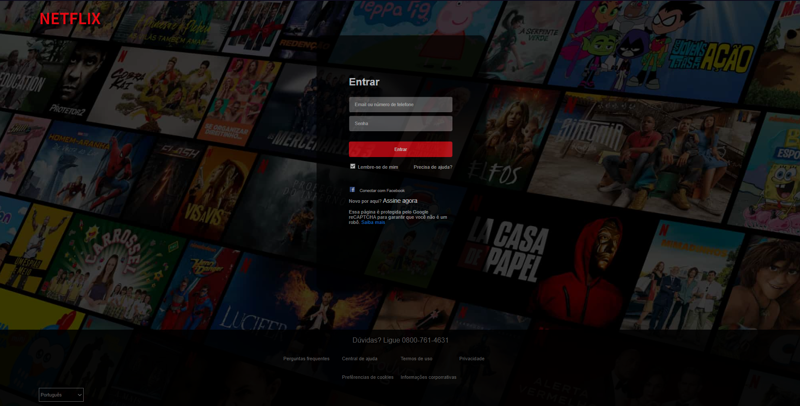

<h1 
    style="color: #E50914; 
    text-align: center; text-shadow: 1px 1px 1.5px black;">  
        Clone página de login NETFLIX
</h1>

Esse projeto possui como intuito a prática e aprendizagem sobre css e criação de páginas.

    Levando como base a tela de login da   
    <a href="https://www.netflix.com/br/login" 
        target="_blank"
        title="Link para a página de referência"
        style="color: #E50914;
        font-family: 'Source Sans Pro', sans-serif;">
            NETFLIX
    </a>

 

<b>Técnologias utilizadas:</b>

 

    Pode conferir a página funcionando no meu 
    <a href="https://Netflix-Clone.saturnz0.repl.co" 
        target="_blank"
        title="Página Netflix no Replit"
    >
            Replit
    </a>

    

 
 
 
<ul>
    <thead>Algumas das refêrencias que usei para encontrar materiais</thead>
    <li><a href="https://www.w3schools.com" target="_blank" title="link para o site da W3school">W3school</a></li>
    <li><a href="https://developer.mozilla.org/pt-BR/" target="_blank" title="link para o site do Mozilla Web Docs">MDN</a></li>

</ul>

